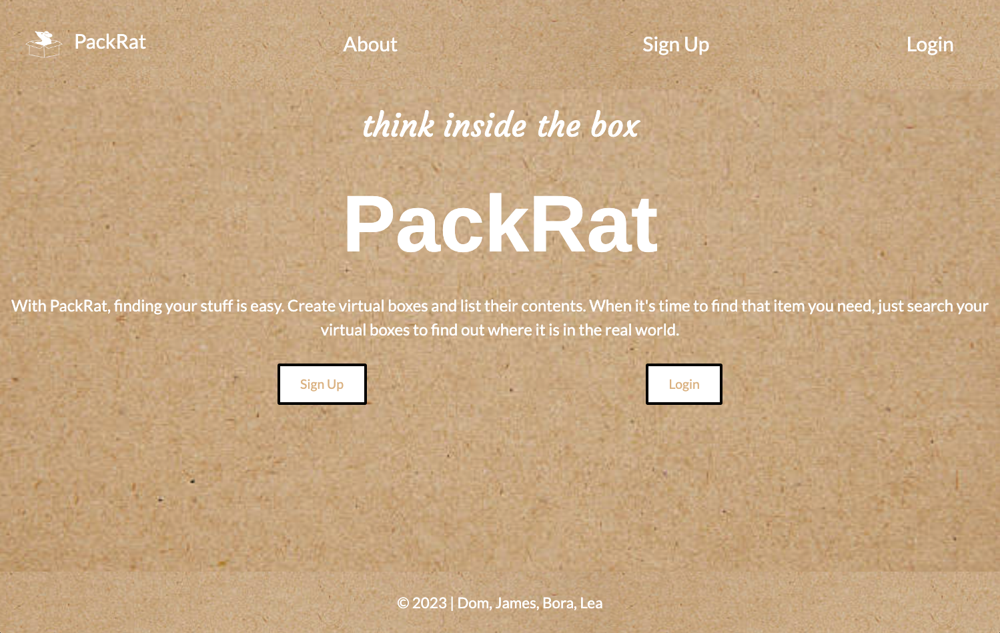

# PackRat

## Overview:
**Packrat**, is a moving app that was created by Team DBJL using a monothilic application React in Rails. Affectionately known as Team Double Jello, Team DBJL was founded by four members of LEARN Academy's Hotel 2022 cohort. The name was created by coining together the first initial of every team member's name; the "**D**" stands for Dominique (Dom), "**B**" is for Bora (Bo), "**J**" is for James, and "**L**" is for Lea, respectively. The idea for this app came after one of our team members had struggled recently with a difficult move, and wondered what could've made the transition to their new home easier. Thus, PackRat was born! Additionally, this app was created as a graduation requirement for capstone, as apart of LEARN Academy's web development curriculum.

**LIVE LINK**: <insert-link-here>

**APP PREVIEW**:

## Features:
With PackRat, finding your stuff is easy. Create virtual boxes and list their contents. When it's time to find that item you need, just search your virtual boxes to find out where it is in the real world.

With PackRat at your side, you will be able to:
- Sign up for your own personal account (for free!)
- Create new boxes with a name to denote what room its for, the contents inside, and selecting a box size
- Edit existing boxes if you've made a mistake
- Delete boxes once you've unpacked that box

## Getting Started/Running the Project:
Moving soon? Don’t get bitten by your move. Use PackRat to keep track of all your belongings!

To run this app locally on your computer:
1. Open your terminal.
2. From the [repo](https://github.com/Team-DBJL/moving-app), clone this project locally.
3. Once cloned, change directory into folder containing project.
4. Run the commands `$ yarn` AND `$ bundle` to add depenencies for React and Rails.
5. Run the command `$ rails s` to start your server.
6. Open a web browser and navigate to localhost:3000
7. Sign up for a new account
8. Enjoy, and happy moving!!

## Dev Dependencies: 
- Reactstrap
- React-Bootstrap
- Webpacker
- Devise
- React
- Ruby on Rails
- React-DOM
- SCSS
- Babel
- Jest
- RSpec

## Contributors:
Team DBJL
- **D**ominique Travis (Tech Lead) - [LinkedIn](https://www.linkedin.com/in/dominque-travis/) | [GitHub](https://github.com/djx-ctrl)
- **B**ora Ros (Product Manager) - [LinkedIn](https://www.linkedin.com/in/bora-ros) | [GitHub](https://github.com/bnros)
- **J**ames Quillen (Project Manager) - [LinkedIn](https://www.linkedin.com/in/jamesquillen/) | [GitHub](https://github.com/jamesquillen)
- **L**ea Hazel (Design Lead) - [LinkedIn](https://www.linkedin.com/in/lea-hazel-452404203/) | [GitHub](https://github.com/lmhazel)